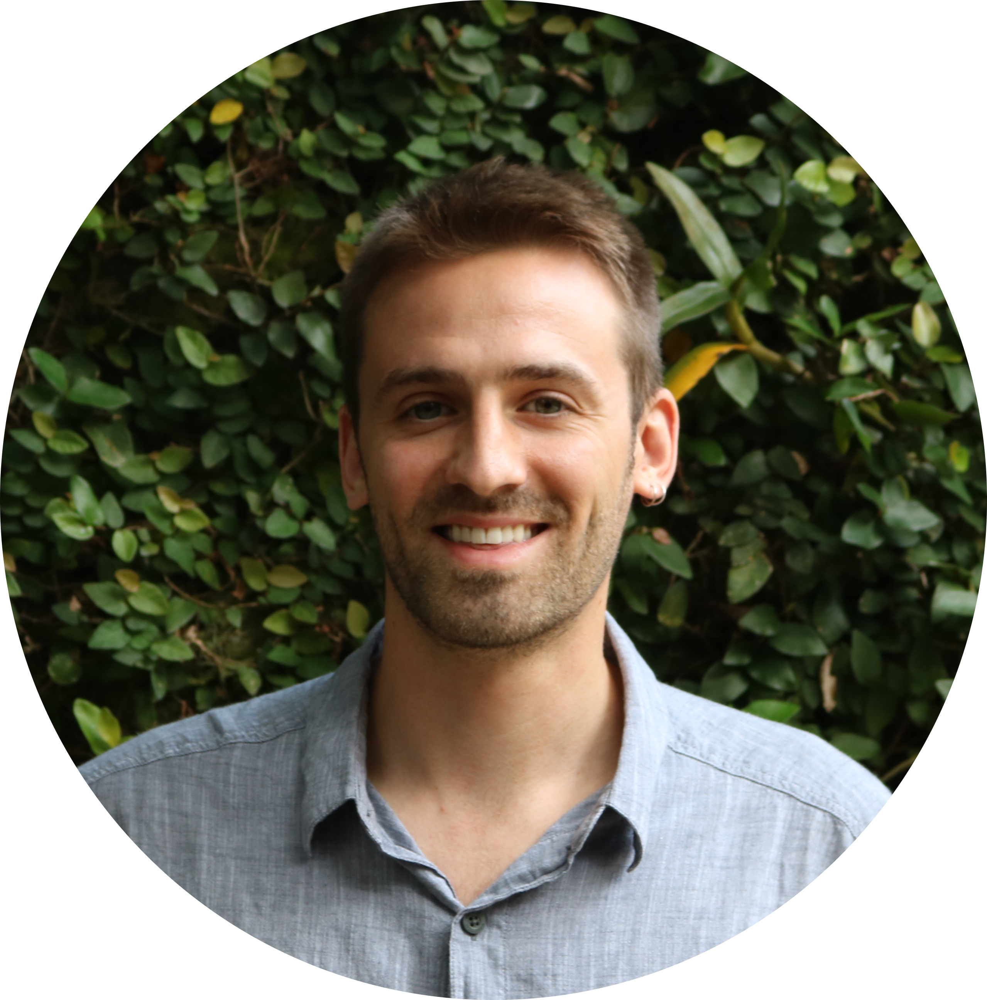

<link rel="stylesheet" href="./academicons-1.8.0/css/academicons.css"/>
<link rel="stylesheet"  type='text/css' href="http://cdnjs.cloudflare.com/ajax/libs/font-awesome/4.3.0/css/font-awesome.css">

  

Jacob (he/him) is an Assistant Professor in the Department of Forest Ecosystems & Society at Oregon State University's College of Forestry. His research focuses on the conservation, management, and restoration of forests, globally. Through his work, he has been fortunate enough to work in forests across the globe - including Thailand, Vietnam, Vanuatu, Brazil, California, and New England. Prior to Oregon State, Jacob was a postdoctoral researcher at Conservation International's Moore Center for Science. Jacob also holds positions as a Science Advisor at [Carbon Direct](https://www.carbon-direct.com/people/dr-jacob-bukoski) and as an Associate Editor at the [Journal of Sustainable Forestry](https://www.tandfonline.com/toc/wjsf20/current).

Get in touch with Jacob at jacob.bukoski@oregonstate.edu

---

  <a href=https://github.com/jbukoski><i class="fab fa-github"></i></a> | 
  <a href=https://twitter.com/JacobBukoski><i class="fab fa-twitter"></i></a> | 
  <a href=https://scholar.google.com/citations?user=gTARLqUAAAAJ&hl=en&oi=ao><i class="ai ai-google-scholar-square"></i></a> |
  <a href=https://www.researchgate.net/profile/Jacob_Bukoski><i class="ai ai-researchgate"></i></a> | 
  <a href=https://www.linkedin.com/in/jacob-bukoski-66728535/><i class="fab fa-linkedin"></i></a>

