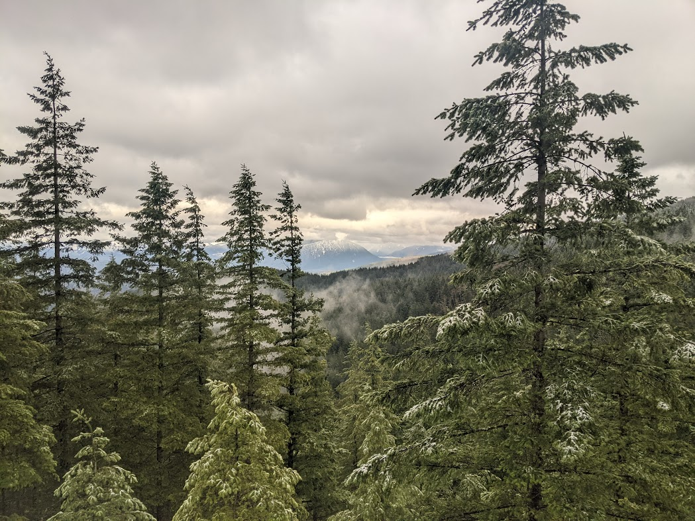

#### Welcome to the Bukoski Lab at Oregon State University!

We research forest-based climate solutions - the projects, policies, and programs that seek to mitigate climate change through improved stewardship of forest ecosystems. Our research is both interdisciplinary and applied, and we often collaborate with individuals and groups across government, non-profit, and the for-profit sectors. By integrating data, methods, and frameworks from both the natural and social sciences, we tackle difficult questions that can guide improved decision-making for forest stewardship. We work across a variety of ecosystem types and spatial scales - but are particularly fond of mangrove ecosystems (the intertidal forests found along tropical and sub-tropical coasts) and our backyard forests of the Pacific Northwest.